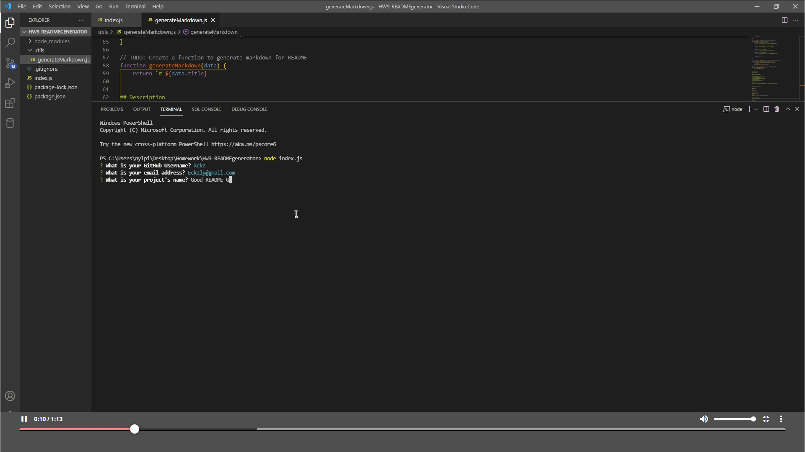

# Good README Generator

## Description

This application will create a professional README file based on the user's inputs.

## Table of Contents

-   [Installation](#installation)
-   [Usage](#usage)
-   [License](#license)
-   [Contributing](#contributing)
-   [Tests](#tests)
-   [Questions](#questions)

## Installation

To install necessary dependencies, run the following command:

npm install inquirer

## Usage

This application is free to use.

## License

MIT
 

## Contributing

Contributing is welcome!

## Tests

To run tests, enter the following command:

node index.js

## Questions

If you have any questions about the repo, open an issue or contact me directly at Eckzly@gmail.com. You can find more of my work at my [GitHub Page](https://github.com/Xckz).
